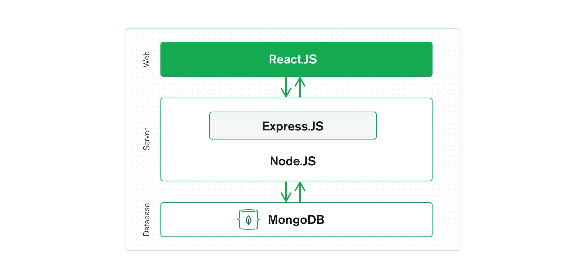

# African Impact Challenge: Community & E-Learning Virtual Platform 
## Table of contents
* [About The Project](#About-The-Project)
* [Installation](#Installation)
* [Contribution](#Contribution)
* [Reference Links](#Reference-Links)


## About The Project
The project is based on the [African Impact Challenge](https://www.africanimpact.ca/the-african-impact-challenge), a continent-focused project that provides aspiring African entrepreneurs the opportunity to solve critical problems with technology. 
The goal of the project is to fulfill the raising needs of the challenge in creating two major consumer segments: \
(1) an user-focused virtual platform to better connect the **start-up community** of the African Impact Challenge and \
(2) an **e-learning space** that is user-friendly and simple to use. 

## Installation
This project will follow closely to the MERN stack model. MERN stands for MongoDB, Express(.js), React(.js), and Node(.js). \
The following explains the relationship of MERN (extract from MongoDB)\
 \
For installation, click [here](https://www.mongodb.com/languages/mern-stack-tutorial) for reading or follow the steps below: 

### Basic Environment Setup
Make sure you have: 
1. Installed Node \
click for [Windows](https://nodejs.org/en/download/) or [Mac](https://nodejs.org/en/)
2. Have a code editor\
You can use any editor your like or I like [VS code](https://code.visualstudio.com/)

### Build With

### Connet to Mongo DB Atlas
1. Sign up or login to [MongoDB Atlas](https://account.mongodb.com/account/register)
2. Notify through the discord server so you can be invited to access the database
3. Once you have been invited to the project, click on the "Database Access" tab. 
4. Add your self as user by clicking on the "ADD NEW DATABASE USER" on the right top corner. Fill in the username and password you prefer.  
 \
5. Click on "Cluster" tab and click on "connect"
6. Choose "Connect your application" as the connection method. A link like the following should appear: \
 \
- Remember to replace the <password> with your own password. Note that "<>" should be deleted.


## Contribution
### Git Flow
This project uses git flow. 

### Branches
- Master
- Develop
- Test
- Feature branches...

### Ticketing
The project will be using Jira and Github Issues for issue tracking. 

### Pull Requests
You can follow the steps below to edit in a separate branch. 
1. Branching off from the main branch and create own branch
```
git checkout -b branch_name
```
2. Implement new features and commit & push the new changes to the branch
```
git add --all
git commit -m “msg”
git push
```
3. Pull Request\
A "Compare & pull request" button will appear and you will be able to create a new pull request. \
- If you are solving for specific issue, include ```Resolves #issue_number``` in the description so that git close the issue automatically. 

4. Merge\
Using ```squash and merge``` is recommended

4. Delete the branch
```
git branch -d local_branch_name
```

## Reference Links
https://www.mongodb.com/mern-stack
